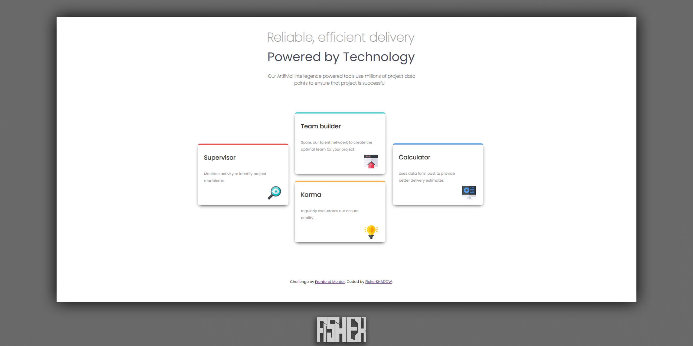

# Frontend Mentor - Four card feature section solution

This is a solution to the [Four card feature section challenge on Frontend Mentor](https://www.frontendmentor.io/challenges/four-card-feature-section-weK1eFYK). Frontend Mentor challenges help you improve your coding skills by building realistic projects. 

## Table of contents

  - [Overview](#overview)
  - [The challenge](#the-challenge)
  - [Screenshot](#screenshot)
  - [Links](#links)
  - [Built with](#built-with)
  - [What I learned](#what-i-learned)
  - [Continued development](#continued-development)
  - [Author](#author) 

**Note: Delete this note and update the table of contents based on what sections you keep.**

## Overview

### The challenge

Users should be able to:

- View the optimal layout for the site depending on their device's screen size

### Screenshot

### Links

- Solution URL: [Add solution URL here](https://www.frontendmentor.io/solutions/four-card-feature-section-master-solved-using-html-and-css-yvhH-tzQYq)
- Live Site URL: [Add live site URL here](https://fishershadow.github.io/four-card-feature-section-master/)

### Built with

- Semantic HTML5 markup
- CSS custom properties

## Author
- Frontend Mentor - [@FisherSHADOW](https://www.frontendmentor.io/profile/FisherSHADOW)
